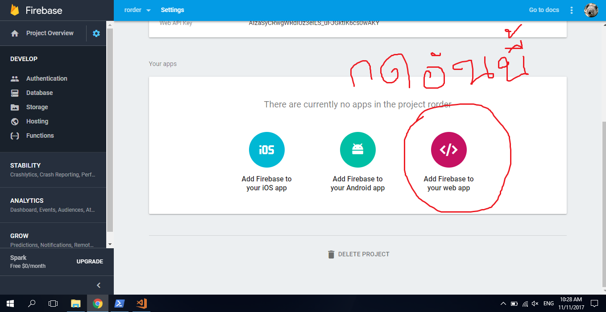

# firebase-login

> A Vue.js project

## First time install

</img>

``` bash
# Create new file in root directory. Named it firebase.config.js.
# Copy everything include {} from to that file
# It should look like this

export default {
  apiKey: 'Faraway',
  authDomain: 'U why u not read',
  databaseURL: 'Cat is fucking annoying',
  projectId: 'Kebob is very delicious',
  storageBucket: 'U should focus dude',
  messagingSenderId: '891671971153'
}

```

## Build Setup

``` bash
# install dependencies
npm install

# serve with hot reload at localhost:8080
npm run dev

# build for production with minification
npm run build

# build for production and view the bundle analyzer report
npm run build --report

# run unit tests
npm run unit

# run e2e tests
npm run e2e

# run all tests
npm test
```

For detailed explanation on how things work, checkout the [guide](http://vuejs-templates.github.io/webpack/) and [docs for vue-loader](http://vuejs.github.io/vue-loader).
